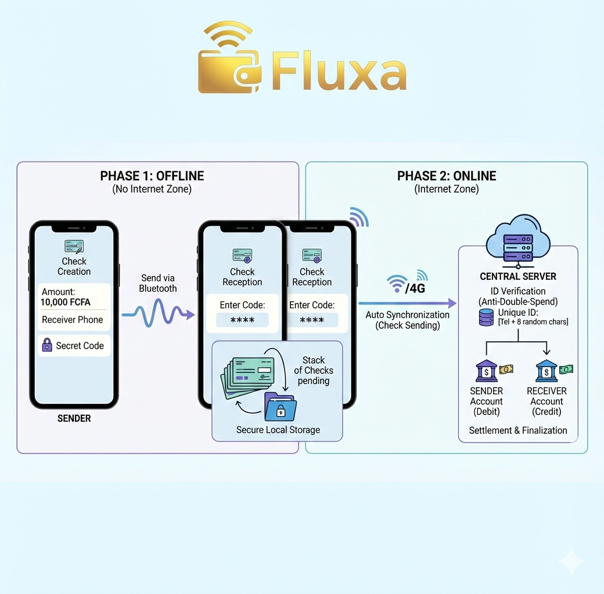

# 🌀 Fluxa | Hybrid Offline P2P Payment System

[](https://www.rust-lang.org)
[](https://tauri.app)
[](https://rustafrica.org)
[](LICENSE)

**Fluxa** is an "offline-first" mobile payment solution designed to break the connectivity barrier in rural Africa. It enables secure financial transactions without the internet, leveraging the power of Rust and Bluetooth Low Energy (BLE).

---

## Video Demo
> https://youtu.be/rUCDTKPkv5I
> *See Fluxa in action: internet-free money transfer between two phones.*

---

## The Problem: The "Connectivity Wall"
In Côte d'Ivoire, as in many regions of Africa, internet connectivity is often unstable or absent (rural areas, crowded markets).
* **The Reality:** Current Mobile Money solutions fail without network coverage.
* **The Consequence:** Farmers and merchants are excluded from the digital economy as soon as the signal vanishes.

## The Solution: The Bluetooth "Digital Check"
Fluxa introduces a secure asynchronous payment protocol:
1.  **Offline Phase:** Users exchange cryptographically signed "payment promises" (Digital Checks) via Bluetooth.
2.  **Security:** Human validation via a temporary secret code and cryptographic validation via Rust.
3.  **Synchronization:** As soon as the merchant regains network access (Wi-Fi/4G), the app automatically synchronizes the stack of checks with the server for final settlement.

---

## Technical Architecture

### 1. Offline Workflow (Local)
* **Sender:** Generates an encrypted payload containing the amount and the recipient's ID.
* **Transmission:** Sent via BLE (Bluetooth Low Energy) using `tauri-plugin-blec`.
* **Receiver:** Receives the file, decrypts it with the oral secret code, verifies the signature, and stores it in a secure **SQLite** database.

### 2. Online Workflow (Server)
* **Auto Sync:** Internet connectivity detection.
* **Settlement:** Batch upload of transactions to the server.
* **Anti-Double Spending:** Verification of unique "Nonces" to prevent fraud.

---

## Why Rust? (The Core of the Project)

The use of Rust is strategic to guarantee financial reliability on mobile devices:

* **Memory Safety:** Indispensable for avoiding crashes and critical security flaws when handling money.
* **Robust Cryptography:** Use of the `ed25519-dalek` crate to sign transactions. It is impossible to forge a digital check.
* **Performance & Size:** Thanks to Rust and Tauri, the application is extremely lightweight (~10 MB) and fast, even on entry-level smartphones, unlike Electron-based solutions.

---

## Tech Stack

| Layer | Technology | Role |
| :--- | :--- | :--- |
| **Mobile Backend** | **Rust** | Business Logic, Cryptography, BLE Management |
| **Mobile Bridge** | **Tauri v2** | Native Android/iOS Communication |
| **Frontend** | **React / TypeScript** | User Interface (Radar, Wallet) |
| **Storage** | **SQLite** | Encrypted Local Database |
| **Protocol** | **BLE (Bluetooth)** | P2P Data Transfer |

---

## Installation and Setup

### Prerequisites
* Rust (latest stable version)
* Node.js & pnpm
* Android Studio (for mobile deployment)

### Steps
1.  **Clone the repository:**
    ```bash
    git clone [https://github.com/Strong-Ari/Fluxa.git](https://github.com/Strong-Ari/Fluxa.git)
    cd Fluxa
    ```

2.  **Install dependencies:**
    ```bash
    pnpm install
    ```

3.  **Run in development mode (Android):**
    * Plug in your Android phone and enable developer mode.
    * Run:
    ```bash
    pnpm tauri android dev
    ```

---

## 👥 The Team
Project developed for the **Rust Africa Hackathon 2026**.

* **Track:** Fintech & Inclusive Finance
* **Members:**
    * Ariel BLE - Lead Developer

---

## License
This project is distributed under the MIT license. See the `LICENSE` file for more information.
